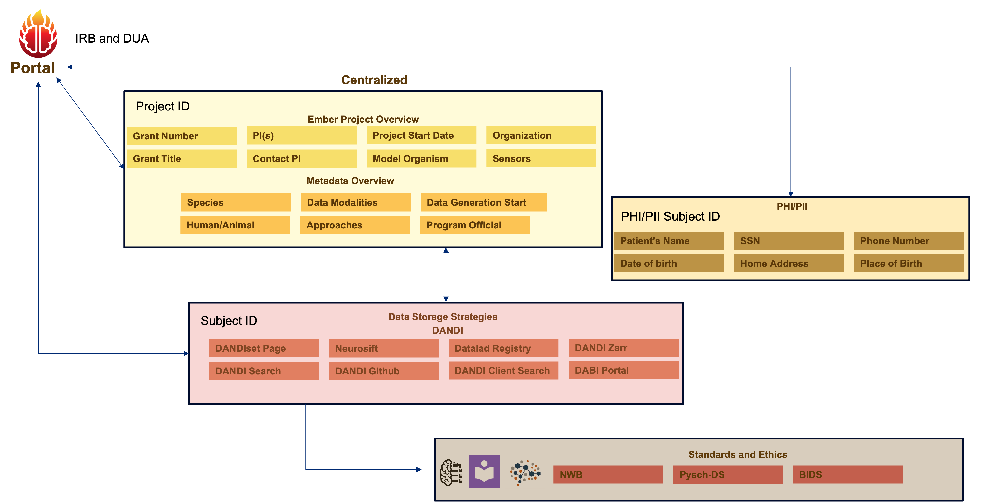

# EMBER x DANDI Metadata Relationships

This repository contains a PlantUML diagram that visualizes the integration of Ecosystem for Multi-modal Brain-behavior Experimentation and Research (EMBER), Distributed Archives for Neurophysiology Data Integration (DANDI), Brain Imaging Data Structure (BIDS), and Neurodata Without Borders (NWB) metadata for neuroimaging and behavioral data management. 

The goal is to provide a clear structure for understanding how these metadata standards interconnect and support data organization across multiple domains.

## Overview
The diagram outlines the following key components:
- **EMBERProject**: Metadata associated with projects, such as Principal Investigator (PI) details, species, sensors, and data modalities.
- **EMBERPHI_PII**: Metadata containing personally identifiable information (PII) or protected health information (PHI).
- **DANDI**: Metadata standards for managing and sharing neuroimaging datasets, including support for NWB and BIDS formats.
- **BIDS**: Brain Imaging Data Structure, a standard for organizing neuroimaging and behavioral data.
- **NWB**: Neurodata Without Borders, a standard for storing complex neurophysiology data.

---

## Library Tables

## EMBERProject
| Attribute               | Data Type      | Description                                          |
|-------------------------|----------------|------------------------------------------------------|
| Type                    | String         | The type of project.                                |
| Link                    | String         | A URL or identifier linking to the project.         |
| PoP_years_max           | String         | Maximum period of performance (years).              |
| Award                   | String         | Award or funding number associated with the project.|
| Title                   | String         | Title of the project.                               |
| PI_Name                 | String         | Name of the Principal Investigator.                 |
| PI_Email                | String         | Email address of the Principal Investigator.        |
| Human_Animal            | String         | Specifies if the study involves humans or animals.  |
| Species_Regular         | String         | Common name of the species.                         |
| Species_Scientific      | String         | Scientific name of the species.                     |
| Sensors                 | String         | Types of sensors used in the study.                 |
| DataModalities          | String         | Types of data modalities used in the study.         |
| Approaches              | String         | Methodologies or approaches used in the study.      |
| DataGenerationSort      | String         | Categorization of data generation methods.          |
| Program_Official        | String         | Name of the program official overseeing the project.|
| Organization            | String         | Organization responsible for the project.           |

## EMBERPHI_PII
| Attribute       | Data Type      | Description                                      |
|-----------------|----------------|--------------------------------------------------|
| Identifier      | String         | Unique identifier for the PII/PHI information.  |
| PII_Fields      | List<String>   | List of personally identifiable information fields.|
| Privacy_Level   | String         | Level of privacy required for the data.         |

## DANDI
| Attribute       | Data Type      | Description                                      |
|-----------------|----------------|--------------------------------------------------|
| Standards       | List<String>   | Supported standards, e.g., "BIDS", "NWB".       |
| Metadata        | String         | Metadata structure used for DANDI datasets.     |

## DANDIsetMetadata
| Attribute       | Data Type      | Description                                      |
|-----------------|----------------|--------------------------------------------------|
| General         | String         | General metadata description.                   |
| Contributors    | List<String>   | List of contributors to the dataset.            |
| SubjectMatter   | String         | Subject or theme of the dataset.                |
| EthicsApprovals | String         | Ethics approvals for the dataset.               |
| Links           | List<String>   | Links to related datasets or resources.         |

## Subject
| Attribute           | Data Type      | Description                                      |
|---------------------|----------------|--------------------------------------------------|
| Imaging             | List<String>   | Types of imaging data collected.                |
| Electrophysiology   | List<String>   | Types of electrophysiological data collected.   |
| Behavioral          | List<String>   | Behavioral data recorded during the study.      |
| Stimuli             | List<String>   | Stimuli presented during experiments.           |
| WearableDevices     | String         | Data from wearable devices.                     |
| Participants        | String         | Metadata about participants in the study.       |
| SessionInfo         | String         | Information about study sessions.               |
| RawData             | String         | Directory or location of raw data files.        |
| DerivedData         | String         | Directory or location of processed data files.  |

## BIDS
| Attribute           | Data Type      | Description                                      |
|---------------------|----------------|--------------------------------------------------|
| DatasetType         | String         | Indicates if the dataset is raw or derived.     |
| BIDSVersion         | String         | Version of the BIDS standard used.              |
| Name                | String         | Name of the dataset.                            |
| License             | String         | License governing dataset usage.                |
| Authors             | List<String>   | List of authors of the dataset.                 |
| Funding             | List<String>   | List of funding sources for the dataset.        |
| EthicsApprovals     | List<String>   | Ethics approvals for the dataset.               |
| SupportedModalities | List<String>   | Data modalities supported in the dataset.       |
| ParticipantsFile    | String         | File containing participant information.        |
| ScansFile           | String         | File containing scan-level metadata.            |
| SessionsFile        | String         | File containing session-level metadata.         |
| PhenotypicData      | String         | File containing phenotypic data.                |
| DatasetDescription  | String         | File describing the dataset.                    |
| Readme              | String         | Readme file for the dataset.                    |
| Citation            | String         | Citation information for the dataset.           |
| Code                | String         | Directory of code used for dataset processing.  |

## NWB
| Attribute       | Data Type      | Description                                      |
|-----------------|----------------|--------------------------------------------------|
| Group           | List<String>   | Organized groups in NWB files.                  |
| Dataset         | List<String>   | Organized datasets in NWB files.                |
| Attribute       | List<String>   | Attributes assigned to NWB groups/datasets.     |
| Link            | List<String>   | Links within NWB files.                         |

## Group
| Attribute       | Data Type      | Description                                      |
|-----------------|----------------|--------------------------------------------------|
| Acquisition     | String         | Data streams recorded from the system.          |
| Intervals       | String         | Experimental intervals.                         |
| Stimulus        | String         | Stimulus data recorded during experiments.      |
| Processing      | String         | Intermediate analysis data.                     |
| Analysis        | String         | Lab-specific or custom analysis data.           |

---
