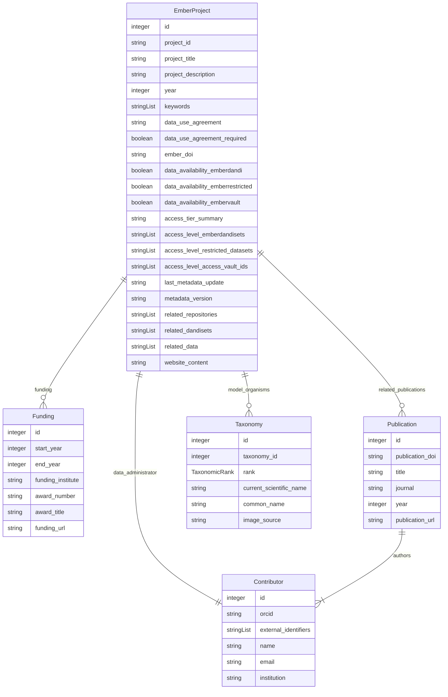

```mermaid
erDiagram
Contributor {
    integer id  
    string orcid  
    stringList external_identifiers  
    string name  
    string email  
    string institution  
}
EmberProject {
    integer id  
    string project_id  
    string project_title  
    string project_description  
    integer year  
    stringList keywords  
    string data_use_agreement  
    boolean data_use_agreement_required  
    string ember_doi  
    boolean data_availability_emberdandi  
    boolean data_availability_emberrestricted  
    boolean data_availability_embervault  
    string access_tier_summary  
    stringList access_level_emberdandisets  
    stringList access_level_restricted_datasets  
    stringList access_level_access_vault_ids  
    string last_metadata_update  
    string metadata_version  
    stringList related_repositories  
    stringList related_dandisets  
    stringList related_data  
    string website_content  
}
Funding {
    integer id  
    integer start_year  
    integer end_year  
    string funding_institute  
    string award_number  
    string award_title  
    string funding_url  
}
Publication {
    integer id  
    string publication_doi  
    string title  
    string journal  
    integer year  
    string publication_url  
}
Taxonomy {
    integer id  
    integer taxonomy_id  
    TaxonomicRank rank  
    string current_scientific_name  
    string common_name  
    string image_source  
}

EmberProject ||--|| Contributor : "data_administrator"
EmberProject ||--}o Funding : "funding"
EmberProject ||--}o Publication : "related_publications"
EmberProject ||--}o Taxonomy : "model_organisms"
Publication ||--}| Contributor : "authors"

```

